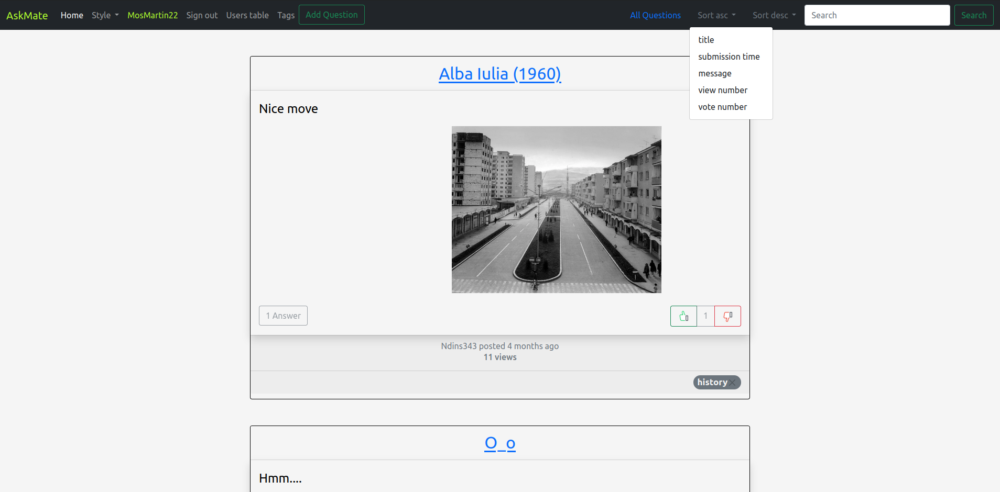
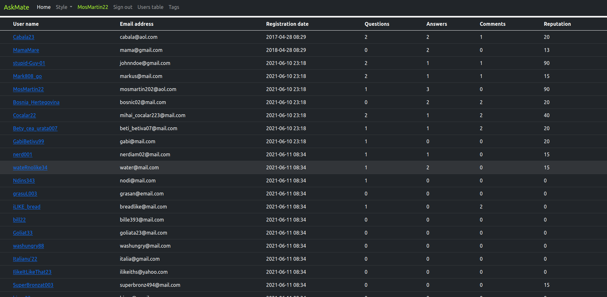
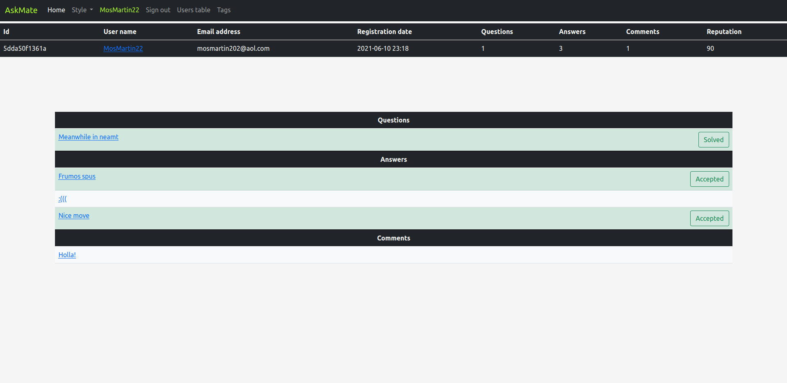
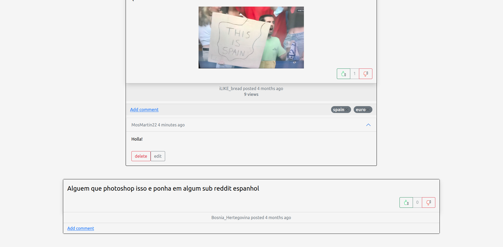

# AskMate

## Description

* Ask mate is a forum where users register, post topics, respond to other topics, comment and vote for posts and answers and more.
* You can search for topics by keywords, tags, title, submission time, view number or vote number
* Day mode and night mode style are available
* The data persists in database

## Technologies used

Python, PostgreSQL, Flask, Bootstrap, Bcrypt, Html, Css

## Installation

Execute db_dump.sql into your psql db. Create connection.properties in resources, add Db name, user and password.

## Implementation

Home page:

Users table:

User info:

Question page:

